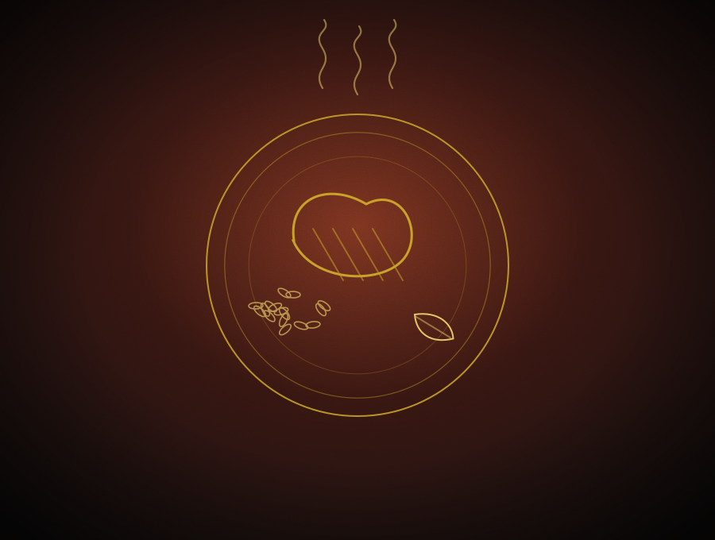

# Tempero D' Família — site institucional

Site de uma página para o restaurante **Tempero D' Família** (Várzea Paulista - SP).
HTML5, CSS3 e JavaScript puros — sem framework, sem build, sem dependências.
Abra o `index.html` no navegador ou envie a pasta para qualquer hospedagem estática.

## Estrutura

```
index.html        conteúdo do site, comentado seção por seção
css/style.css     estilos, organizados em 14 blocos numerados
js/main.js        interações, organizadas em 10 blocos numerados
assets/           logo e imagens
```

## Identidade visual

| Elemento   | Escolha                                                        |
|------------|----------------------------------------------------------------|
| Cores      | vinho `#6B1220`, dourado `#C9A227`, grafite `#0E0C0B`, marfim `#F6F1E8` |
| Títulos    | Playfair Display (serifada, com itálico nos destaques)          |
| Texto e UI | Poppins (leve, com versaletes espaçados nos rótulos)            |

Todas as cores são variáveis CSS no topo do `css/style.css` (bloco 1).
Trocar `--vinho` e `--ouro` muda o site inteiro.

## Interações

Cabeçalho que ganha fundo sólido ao rolar · parallax na imagem do hero ·
entrada dos elementos em fade + slide conforme a rolagem · abas do cardápio com
marcador deslizante · zoom e legenda nas fotos da galeria com lightbox ·
contagem animada da nota do Google · menu de celular em tela cheia ·
botão flutuante de WhatsApp que surge após o hero.

Tudo respeita `prefers-reduced-motion` e o site continua legível com o JavaScript
desligado (as animações só são aplicadas quando há JS).

## As imagens são provisórias

**Não consegui usar fotos reais**: o ambiente onde o site foi montado não tem acesso
a bancos de imagem. No lugar delas, criei ilustrações em linha dourada sobre fundo
escuro (`assets/*.svg`), que seguem a identidade do site e funcionam como placeholder
apresentável.

**Substitua por fotos reais assim que possível** — é o que vai elevar o site de vez.
Salve a foto em `assets/` e troque o `src` da `` correspondente:

```html
<!-- antes -->

<!-- depois -->

```

Onde cada arquivo aparece:

| Arquivo                | Onde é usado                  | Proporção sugerida |
|------------------------|-------------------------------|--------------------|
| `hero.svg`             | fundo do banner principal     | 16:9, bem larga    |
| `historia.svg`         | seção "Nossa história"        | retrato, 4:5       |
| `prato-*.svg` (11)     | cards do cardápio             | 4:3                |
| `galeria-*.svg` (6)    | mosaico da galeria            | 4:3                |
| `logo.svg`             | cabeçalho, rodapé e favicon   | quadrada           |

## Como editar

**WhatsApp** — procure `5511914197612` no `index.html` (8 ocorrências: cabeçalho,
hero, cardápio, contato, rodapé e botão flutuante). Formato: `55` + DDD + número.
O telefone clicável está em `tel:+5511914197612`.

**Cardápio** — na seção `5. CARDÁPIO`, cada prato é um `<article class="prato">`.
Copie o bloco para adicionar, apague para remover. Para uma categoria nova, crie o
botão em `.abas` com `data-aba="nome"` e o `<div class="cardapio__grupo"
data-grupo="nome">` correspondente. **Os pratos e preços atuais são exemplos.**

**Horários** — na seção `8. CONTATO`, na lista `<ul id="horarios">`. Mantenha o
formato `11:00 – 23:00` (ou escreva `Fechado`). O selo "Aberto agora / Fechado" é
calculado sozinho a partir dessa lista. Só o fechamento às 23h está confirmado no
Google; os demais dias são um ponto de partida para conferir.

**Redes sociais** — no rodapé, troque o `href="#"` de Instagram e Facebook.

**Avaliações** — o botão leva a uma busca pelo restaurante no Google Maps. Para
apontar direto ao perfil do Google Meu Negócio, copie o link do perfil e substitua a
URL. Por escolha, o site **não traz depoimentos escritos** — só a nota real
(4,5 com 15 avaliações) e o link para as avaliações verdadeiras.

## SEO e performance

Meta tags de descrição, palavras-chave e Open Graph com nome e cidade · dados
estruturados JSON-LD do tipo `Restaurant` (endereço, telefone, faixa de preço e nota,
o que ajuda a aparecer melhor na busca local) · `loading="lazy"` e `decoding="async"`
em todas as imagens abaixo da dobra · fontes com `display=swap` · CSS e JS únicos,
sem bibliotecas externas.

## Publicação

Serve qualquer hospedagem estática (GitHub Pages, Netlify, Vercel, Hostinger).
Para o GitHub Pages: **Settings → Pages → Deploy from a branch**, escolha a branch e
a pasta `/ (root)`.
